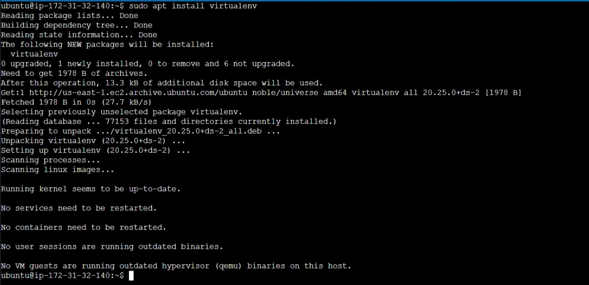

<div align="center">

# 🍷 MLflow Wine Quality Prediction on AWS


An end-to-end MLOps project demonstrating MLflow integration with AWS for model training, tracking, and deployment.

[](https://www.python.org/downloads/)
[](https://mlflow.org/)
[](https://scikit-learn.org/)
[](LICENSE)

</div>

## 📌 Table of Contents
- [Project Overview](#-project-overview)
- [System Architecture](#-system-architecture) <!-- Animation on hover -->
- [Features](#-features) <!-- Animation on hover -->
- [Tech Stack](#-tech-stack) <!-- Animation on hover -->
- [Project Structure](#-project-structure) <!-- Animation on hover -->
- [Environment Setup](#-environment-setup) <!-- Animation on hover -->
- [AWS Infrastructure Setup](#-aws-infrastructure-setup) <!-- Animation on hover -->
- [Installation](#-installation) <!-- Animation on hover -->
- [Usage](#-usage) <!-- Animation on hover -->
- [Model Training and Tracking](#-model-training-and-tracking) <!-- Animation on hover -->
- [Contributing](#-contributing) <!-- Animation on hover -->
- [License](#-license) <!-- Animation on hover -->

<style> 
/* Add smooth scrolling animation */
html {
  scroll-behavior: smooth;
}
</style>

## 🎯 Project Overview

This project implements a machine learning pipeline for wine quality prediction using MLflow for experiment tracking and model management. The unique aspect of this implementation is its integration with AWS services, where the MLflow tracking server runs on an EC2 instance and artifacts are stored in S3 buckets.

## 🏗 System Architecture

Our MLOps pipeline consists of:
1. **Local Development Environment**: Where model training code is executed
2. **AWS EC2**: Hosts the MLflow tracking server
3. **AWS S3**: Stores model artifacts and experiment data
4. **MLflow**: Manages the entire ML lifecycle

## ✨ Features

- 🔄 Automated ML pipeline for wine quality prediction
- 📊 Real-time experiment tracking with MLflow
- ☁️ AWS integration for scalable model deployment
- 📈 Comprehensive metric logging (RMSE, MAE, R2)
- 🔍 Hyperparameter tuning capabilities
- 🏆 Model versioning and management

## 🛠 Tech Stack

- **Python**: Core programming language
- **MLflow**: ML lifecycle management
- **scikit-learn**: Machine learning library
- **pandas**: Data manipulation
- **boto3**: AWS SDK for Python
- **AWS Services**: EC2, S3

## 📁 Project Structure

```
mlflow-wine-quality/
├── app.py                # Main training script
├── requirements.txt      # Project dependencies
├── _asserts/            # Project documentation images
└── mlruns/              # Local MLflow tracking directory
```

## 🌍 Environment Setup

<details>
<summary>View Environment Configuration</summary>

</details>

## ☁️ AWS Infrastructure Setup

### 1. IAM User Creation & Permissions
<details>
<summary>View IAM Setup Steps</summary>


</details>

### 2. EC2 Instance Configuration
<details>
<summary>View EC2 Setup Steps</summary>


</details>

### 3. S3 Bucket Setup
<details>
<summary>View S3 Setup Steps</summary>

</details>

## 💻 Installation

1. Clone the repository:
```bash
git clone <repository-url>
cd mlflow-wine-quality
```

2. Install dependencies:
```bash
pip install -r requirements.txt
```

3. Configure AWS credentials:
```bash
aws configure
```

<details>
<summary>View AWS Configuration Steps</summary>


</details>

## 🚀 Usage

Run the training script with custom parameters:

```bash
python app.py <alpha> <l1_ratio>
```

Example:
```bash
python app.py 0.5 0.5
```

## 📈 Model Training and Tracking

The project uses an ElasticNet model with customizable hyperparameters:
- `alpha`: Constant that multiplies the penalty terms (default: 0.5)
- `l1_ratio`: The ElasticNet mixing parameter (default: 0.5)

Tracked metrics:
- 📊 RMSE (Root Mean Square Error)
- 📊 MAE (Mean Absolute Error)
- 📊 R² Score

Access the MLflow UI at: `http://ec2-54-158-152-207.compute-1.amazonaws.com:5000`

<details>
<summary>View MLflow UI Access</summary>

</details>

## 🤝 Contributing

1. Fork the repository
2. Create a new branch
3. Make your changes
4. Submit a pull request

## 📄 License

This project is licensed under the MIT License - see the [LICENSE](LICENSE) file for details.

---

<div align="center">
Made with ❤️ for the MLOps community
</div>
